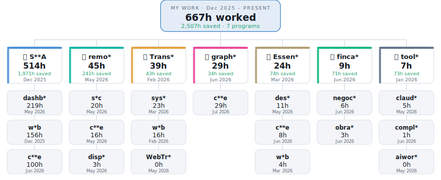

# Hi, I’m Vlad Cioca 👋

## Who am I?

I’m the CEO at SAVA Logistic, based in Castellar del Vallès. Background in Business Administration (logistics focus) and hands-on experience leading international transport operations, customer retention, and issue resolution in the logistics sector. 

## What am I currently working on?

* Building and scaling **n8n automations** (agentic workflows, ops + marketing pipelines, reporting, and integrations).

## What tools do I use?

* **Automation / Agents:** n8n, Antigravity
* **Dev:** Visual Studio Code
* **LLMs:** Claude, Gemini
* **Data / Backend:** Supabase
* **Ops stack:** Google Workspace

## How to reach me

* **WhatsApp:** [+34627259871](https://wa.me/34627259871)
* **Email:** [vlad.cioca@savaexpress.com](mailto:vlad.cioca@savaexpress.com)

<!--
**xRyUxSama/xRyUxSama** is a ✨ _special_ ✨ repository because its `README.md` (this file) appears on your GitHub profile.

Here are some ideas to get you started:

- 🔭 I’m currently working on ...
- 🌱 I’m currently learning ...
- 👯 I’m looking to collaborate on ...
- 🤔 I’m looking for help with ...
- 💬 Ask me about ...
- 📫 How to reach me: ...
- 😄 Pronouns: ...
- ⚡ Fun fact: ...
-->

<!-- claude-tracker:start -->
## 🌳 What I've built

<picture>
  <source media="(prefers-color-scheme: dark)" srcset="assets/work-tree-dark.svg">
  
</picture>

Auto-generated by my tracker · all-time hours worked · names masked · updated 2026-07-05
<!-- claude-tracker:end -->
